<h1 align="center"></h1>

Projeto desenvolvido durante a participação no programa Desenvolve Boticário 2024 em parceria com a escola Alura. 
O desafio era construir do zero um  site responsivo completo para uma empresa do ramo de cosméticos, com foco na criação de um layout flexível que se adapte a dispositivos móveis e desktop.
A empresa MV Cosméticos é uma empresa fictícia criada para a realização do projeto.

## Tecnologias Utilizadas

  
  
  
  

 

## Desenvolvido na IDE

 

## RESPONSIVIDADE:

O site foi desenvolvido inicialmente para mobile e posteriormente foi sendo ajutado para as telas com resoluções <strong>1024px</strong> e <strong>1728px</strong>.

**MOBILE:**

- O cabeçalho da página é composto por menu hamburguer, campo para busca de produtos, nome da empresa centralizado no topo da página, ícone clicável para acessar os favoritos e ícone de um carrinho de compras clicável para acessar os produtos inseridos no carrinho. 

- Ao clicar no ícone do menu hamburguer/sanduiche, é exibido um menu suspenso com opção de longin/Cadastro e as opções específicas dos produtos comercializados pela empresa (lançamentos, maquiagem, perfumaria, cabelos, kits para presentear), o menu também referencia informações sobre e de contato com a empresa (sobre a MV Cosméticos, fale conosco, seja um colaborador, ouvidoria).

- No card abaixo do cabeçalho contém informações a respeito da entrega de produtos;

- Em seguida uma seção de lançamento de uma linha de produtos, seguido de outra contendo mais lançamentos;

- A seção Mais Lançamentos está inserida em um carrosel (com um slide por visualização);

- A seção Destaques do Mês também está contida em um carrosel com uma visualização por vez;

- Na seção Fique por dentro das novidades, há um campo para que o usuário cadastre seu e-mail para receber newsletters da empresa;

- O rodapé é composto pela logo da empresa e por ícones que ao clicar direcionam o usuário para as redes socias da empresa;

- Na base do rodapé há informações de Copyright.

  

  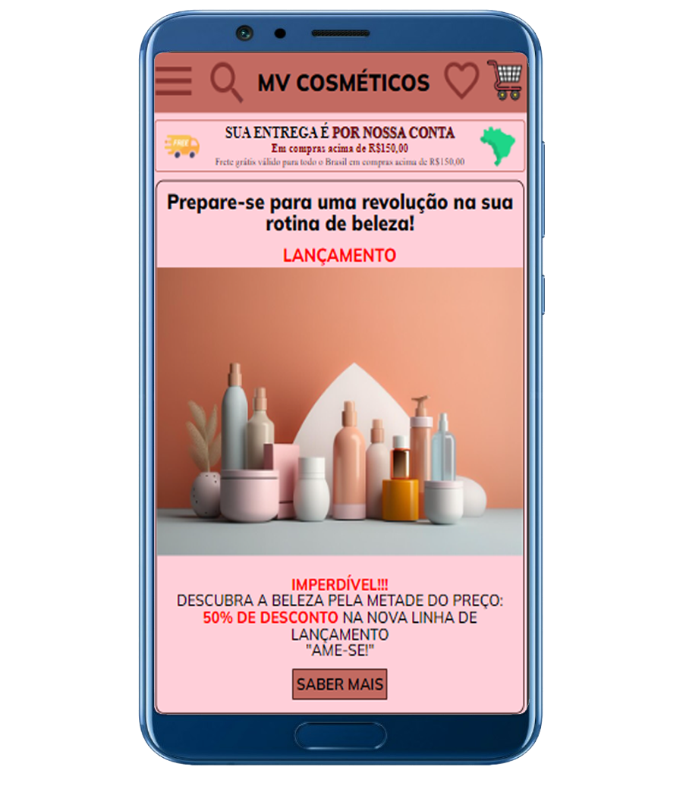
    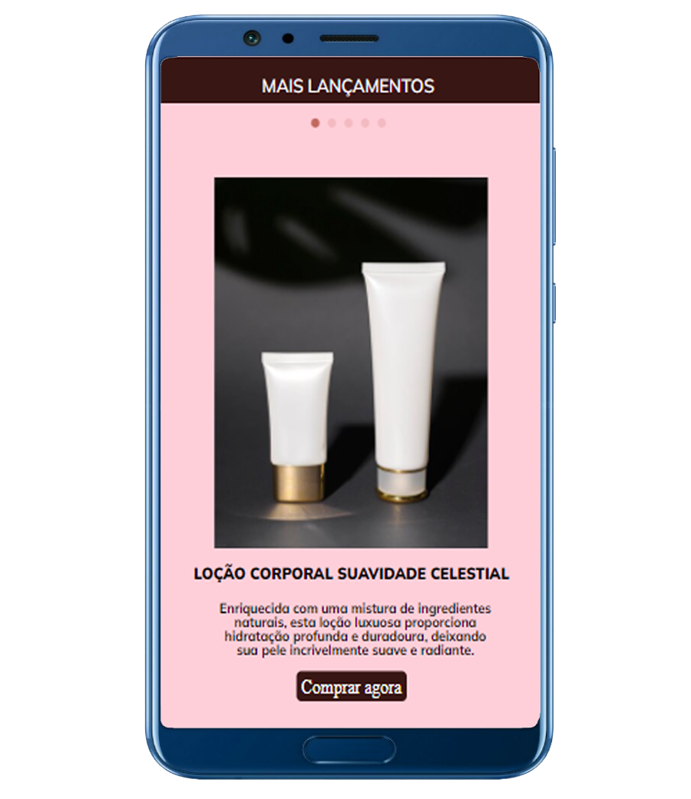
    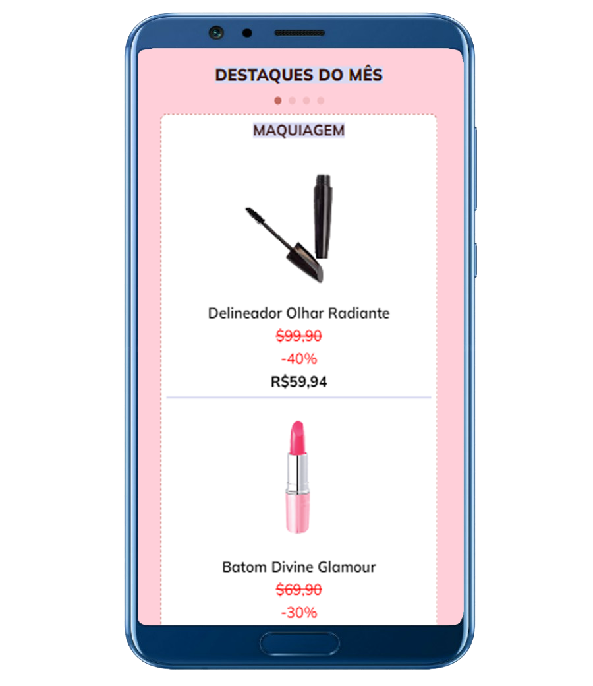
    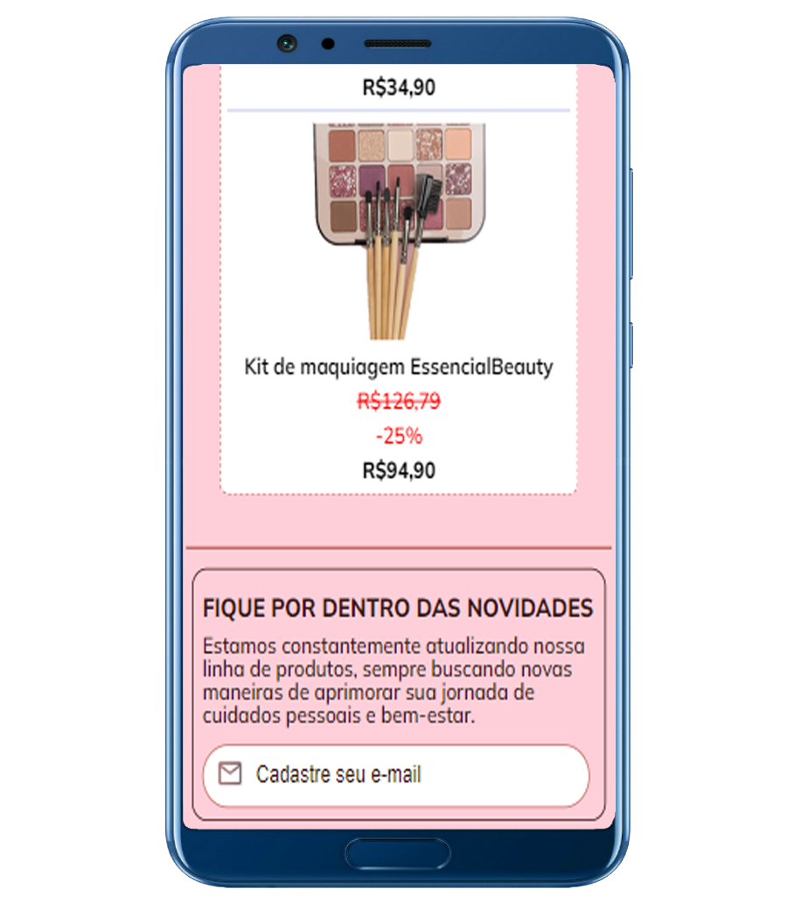
    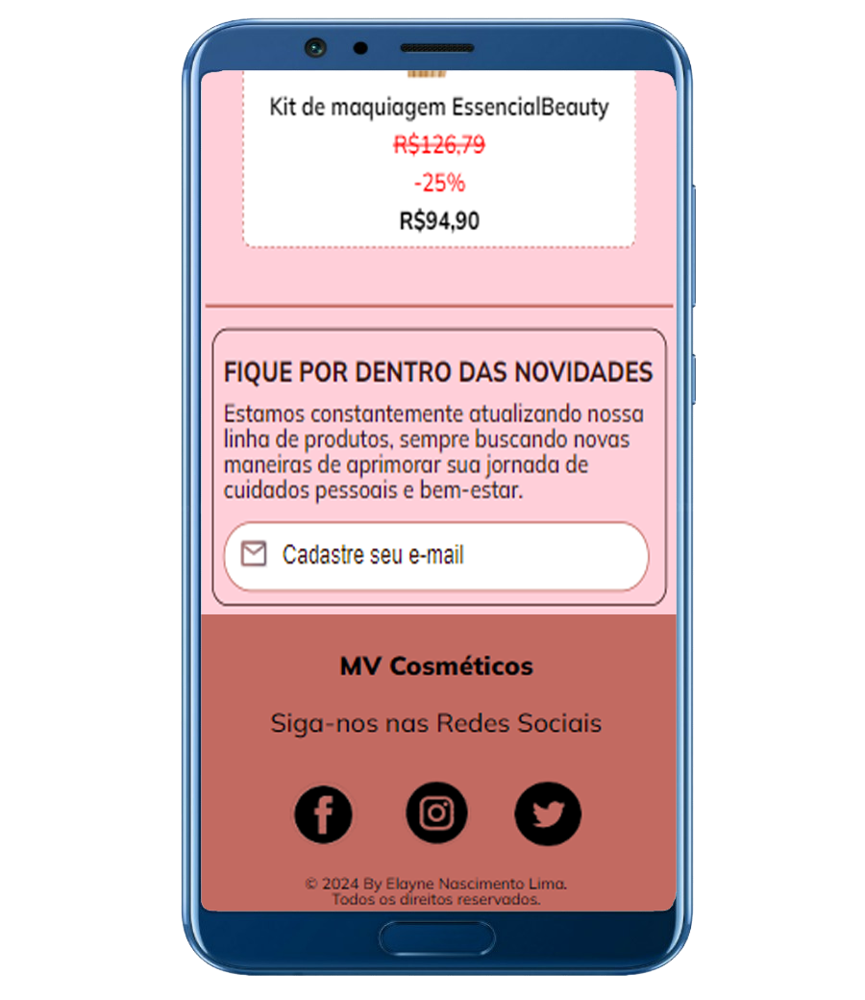

 

**Resoluções a partir de 1024px:**

-  Nessa resolução o menu está localizado no topo da página com três itens (Categorias, Favoritos e A Empresa), a logo da empresa está no canto esquerdo do cabeçalho e no canto direito estão os ícones clicáveis de um carrinho de compras e seção para login/cadastro;

- O item categoria guarda um menu suspenso. Ao clicar é exibido o menu com as categorias Lançamentos, Maquiagem, Perfumaria, Cabelos, Kits Para Presentear;

- A seção de entregas permance inalterada;

- A área para busca de produtos agora está localizada abaixo do card de entrega;

- O carrossel das seções Mais Lançamentos e Destaques do mês, exibe dois slides por visualização;

- Além das opção cadastrar e-mail, foi adionado o link para entrar no grupo de WhatsApp, para que o usuário receba informações sobre novidades, lançamentos, promoções... da empresa;

- O rodapé recebe um menu contendo as opções Lançamentos, Maquiagem, Perfumaria, Cabelos, Kits Para Presentear.

  

  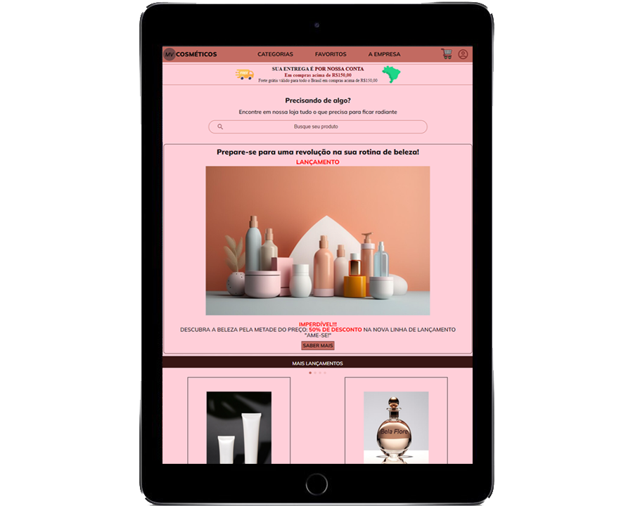
  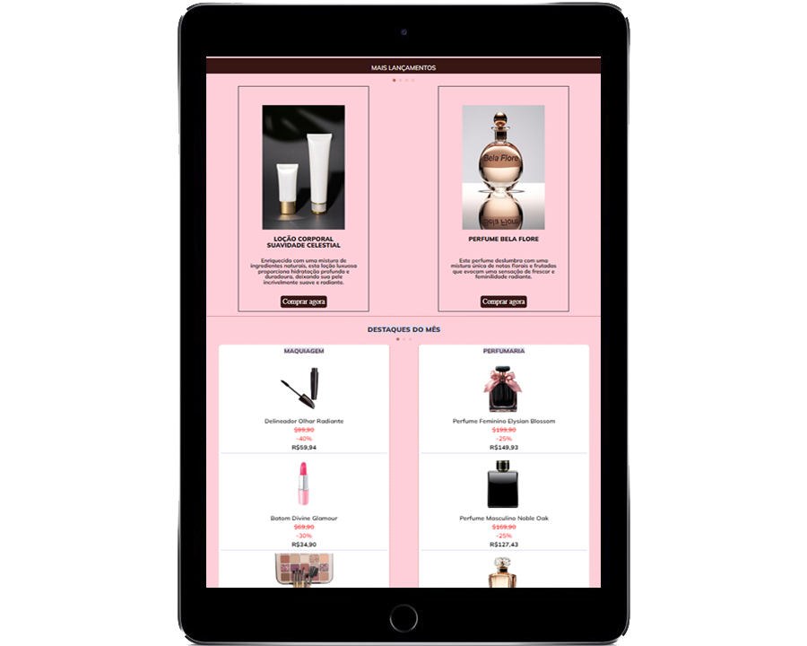
  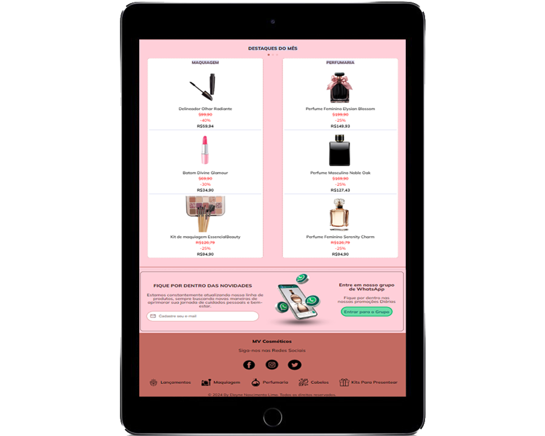

 

**Resoluções a partir de 1728px:**

- Nessa resolução o menu está maior e as categorias do menu (Maquiagem, Perfumes, Cabelos, Corpo), recebem subcategorias, exibidas ao clicar em cada item do menu;

- A visualização do carrossel nas seções Mais Lançamentos e Destaques do mês, exibe 3 (três) slides por visualização;

- O rodopé recebeu mais opções de menu (Sobre a MC Cosméticos, Fale conosco, Seja um colaborador, Ouvidoria).

  

  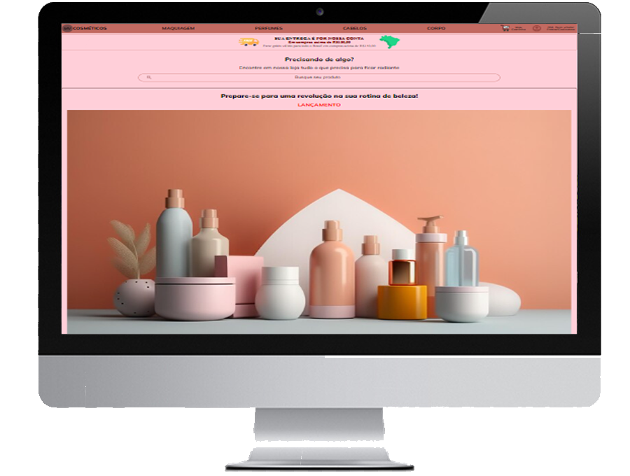
  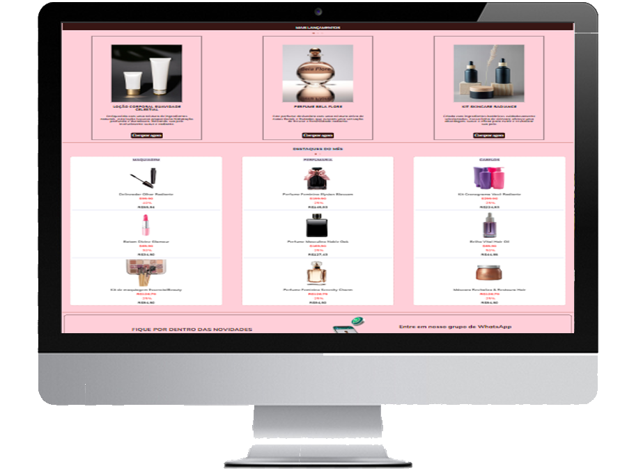
  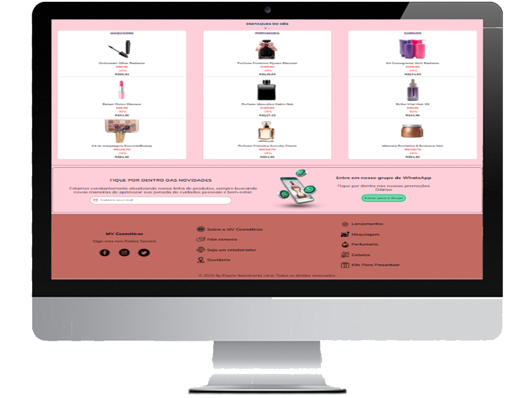

 

## Status do projeto

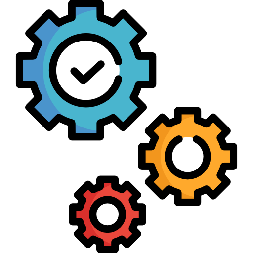 Em desenvolvimento   

Apesar dos ícones serem clicávéis e possuir menu já determinado, campo de busca e cadastrao de e-mail... Ainda não faz o direcionamento específico.

Acesse o projeto completo:  
[GitHub Pages](https://elaynenl.github.io/Projeto-Front-End-Ecommerce/)
 
[Vercel](https://projeto-front-end-ecommerce.vercel.app/)
