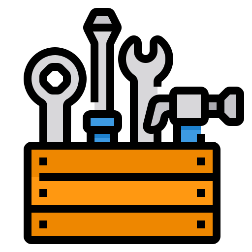

<h1 align="center"></h1>

Projeto desenvolvido durante a participação no programa Desenvolve Boticário 2024 em parceria com a escola Alura. 
O desafio inicial era construir do zero um  site responsivo completo para uma empresa do ramo de cosméticos, com foco na criação de um layout flexível que se adapte a dispositivos móveis e desktop.
O foco do segundo desafio era adicionar funcionalidades interativas com JavaScript, o que poderia incluir recursos como menu suspenso, carrossel de imagens, dentre outras interações.
No terceiro e último desafio, o foco foi desenvolver para o projeto uma API REST com Node, Express, fazendo uso do banco de dados MongoBD para armazenamento de dados e conectá-la com o Front-End usando o Fetch.
A empresa MV Cosméticos é uma empresa fictícia criada para a realização do projeto.

## Tecnologias Utilizadas

  
  
  
  
  
  
  

 

## Desenvolvido na IDE

 

## RESPONSIVIDADE:

O site foi desenvolvido inicialmente para mobile e posteriormente foi sendo ajutado para as telas com resoluções <strong>1024px</strong> e <strong>1728px</strong>.

**MOBILE:**

- O cabeçalho da página é composto por menu hamburguer, campo para busca de produtos, nome da empresa centralizado no topo da página, ícone clicável para acessar os favoritos e ícone de um carrinho de compras clicável para acessar os produtos inseridos no carrinho. 

- Ao clicar no ícone do menu hamburguer/sanduiche, é exibido um menu suspenso com opção de Login/Cadastro e as opções específicas dos produtos comercializados pela empresa (lançamentos, maquiagem, perfumaria, cabelos, kits para presentear), o menu também referencia informações sobre e de contato com a empresa (sobre a MV Cosméticos, fale conosco, seja um colaborador, ouvidoria).

- No card abaixo do cabeçalho contém informações a respeito da entrega de produtos;

- Em seguida uma seção de lançamento de uma linha de produtos, seguido de outra contendo mais lançamentos;

- A seção Mais Lançamentos está inserida em um carrossel (com um slide por visualização);

- A seção Destaques do Mês também está contida em um carrossel com uma visualização por vez;

- Na seção "Fique por dentro das novidades", há um campo para que o usuário cadastre seu e-mail para receber newsletters da empresa;

- O rodapé é composto pela logo da empresa e por ícones que ao clicar direcionam o usuário para as redes socias da empresa;

- Na base do rodapé há informações de Copyright.

  

  
    
    
    
    

 

**Resoluções a partir de 1024px:**

-  Nessa resolução o menu está localizado no topo da página com três itens (Categorias, Favoritos e A Empresa), a logo da empresa está no canto esquerdo do cabeçalho e no canto direito estão os ícones clicáveis de um carrinho de compras e seção para login/cadastro;

- O item categoria guarda um menu suspenso. Ao clicar é exibido o menu com as categorias Lançamentos, Maquiagem, Perfumaria, Cabelos, Kits Para Presentear;

- A seção de entregas permanece inalterada;

- A área para busca de produtos agora está localizada abaixo do card de entrega;

- O carrossel das seções Mais Lançamentos e Destaques do mês, exibe dois slides por visualização;

- Além das opções cadastrar e-mail, foi adicionado o link para entrar no grupo de WhatsApp, para que o usuário receba informações sobre novidades, lançamentos, promoções... da empresa;

- O rodapé recebe um menu contendo as opções Lançamentos, Maquiagem, Perfumaria, Cabelos, Kits Para Presentear.

  

  
  
  

 

**Resoluções a partir de 1728px:**

- Nessa resolução o menu está maior e as categorias do menu (Maquiagem, Perfumes, Cabelos, Corpo), recebem subcategorias, exibidas ao clicar em cada item do menu;

- A visualização do carrossel nas seções Mais Lançamentos e Destaques do mês, exibe 3 (três) slides por visualização;

- O rodapé recebeu mais opções de menu (Sobre a MC Cosméticos, Fale conosco, Seja um colaborador, Ouvidoria).

  

  
  
  

 

## Interatividade
 

O projeto possui código JavaScript que confere interatividade à página, seja na resolução mobile ou em resoluções maiores. 
 

Interatividades: 

- No mobile ao tocar no menu-hambúrguer o menu aparece suspenso e ao tocar em qualquer região fora do menu, o menu é recolhido.

- Nas demais resoluções, o menu é projetado para abrir automaticamente quando o cursor do mouse passa sobre ele e fechar quando é retirado, ou seja quando o cursor do mouse passa sobre o item do menu ele se expande para mostrar os submenus e ao retirar o cursor de cima, ele se recolhe ocultando as opções.

- Em todas as resoluções, foi aplicado o efeito carrossel nas sessões "Mais Lançamentos" e "Destaques". O carrossel aplicado é "infinito", ou seja, reinicia sempre que chega à última imagem disponível na sessão.

Menu Promoções: 

No menu mobile o menu "Promoções" é acessível através do Menu hambúrguer, nas resoluções a partir de 1024px, é acessível através do menu Categorias e nas resoluções acima de 1728px o menu promoções faz parte dos menus principais da página. 

Manipulação do DOM: 

Ao acessar o menu Promoções, o DOM é manipulado com JavaScript para que os produtos em promoção sejam exibidos na tela. O código inicial utilizava HTML e usava a tag UL e LI para criar uma lista, porém foi refatorado para que essa manipulação ocorra usando JavaScript por meio da propriedade innerHTML.  

  

## Busca de produtos
 

Até o momento a busca por produtos foi adicionada apenas à página de Produtos em Promoção, acessível através do Menu Promoções cujo caminho de acesso foi citado acima. Ao acessar a página, diversos produtos (fictícios) serão mostrados na tela, bem como um campo de busca de produtos. Essa busca pode ser feita por palavra-chave completa ou até mesmo por parte de uma palavra. Ex: Perfume (as letras podem ser maíusculas ou minúsculas), ou "per". Para realizar a pesquisa o usuário pode fazer uso do botão "Pesquisar" ou do "Enter" no teclado. Ao retornar a busca o campo de pesquisa é limpo e um "botão" para retornar para "Todos os produtos" aparece na tela. Caso o produto pesquisado não esteja na lista, retorna um aviso informando que o produto não foi encontrado. 

 

 

## Cadastro e Login de Usuários  

O usuário pode realizar seu cadastro através do formulário que está acessível no menu hambúrguer(mobile) e, nas demais resoluções, está acessível no ícone de usuário no canto superior direito da tela. O formulário (Front end) se conecta com a API REST(Back end) através do Fetch ( função nativa do JavaScript que se realiza requisições assíncronas aos servidores) e salva os dados no MongoDB. 
Na mesma página há a tela de login, onde o usuário usa o e-mail e senha cadastrados para a acessar o perfil de usuário. Ao realizar o login o usuário é direcionado para a página de boas-vindas, onde há uma mensagem personalizada conforme o gênero sinalizado por ele ao se cadastrar.
 

## API REST  

Foi desenvolvida uma API REST com algumas rotas, tanto para os produtos do menu Promoções, quanto para o Cadastro e Login de Usuários. 

- A rota ( / ), serve a página principal do projeto;
- A rota ( /produtosEmPromocao), serve o menu Promoções, e através dessa rota, os produtos cadastrados no MongoDB são retornados em tela, então o DOM é manipulado e cria os produtos com os estilos aplicados no código.
- A rota (/cadastro-e-login) serve a página de Cadastro e Login de usuários.
- A rota (/meu-perfil), serve a página de Boas Vindas.
 

A API possui o CRUD (Create, Read, Update, Delete) completo, tanto para produtos como para usuários, porém ainda faltam algumas implementações a serem feitas, para que através do Front end seja possível testar todas as funcionalidades. 

Todas as rotas foram testadas através do client de API Postman.

## Status do projeto

 Em desenvolvimento   

Ainda serão implementados testes, validações, autenticações e mais funcionalidades para aprimorar o que já foi desenvolvido até aqui

Acesse o projeto completo:  
[Vercel](https://projeto-desenvolve.vercel.app/)

 

## Autor

Desenvolvido por Elayne Nascimento Lima

## Licença

Projeto licenciado sob a licenca MIT.

